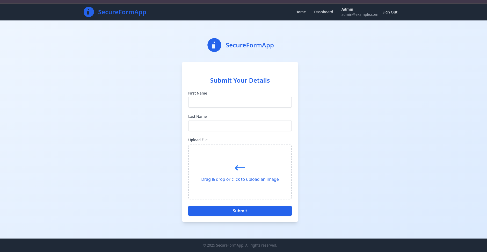
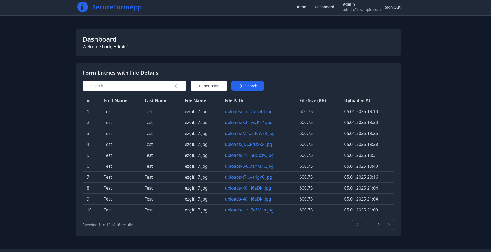
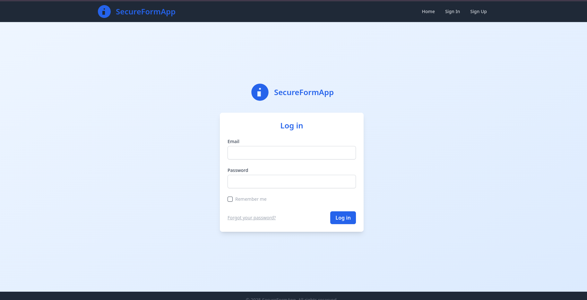
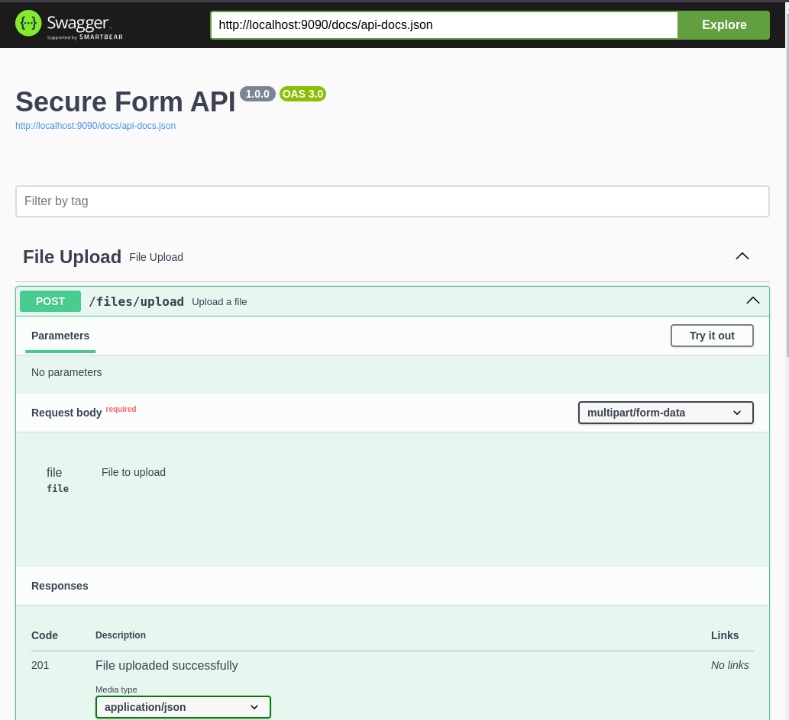

# Secure Form Laravel Application

## Overview

The **Secure Form Laravel Application** is a hybrid modular monolith built with **Clean Architecture** and **Domain-Driven Design (DDD)** principles. This application allows users to submit forms and upload files in a secure and efficient manner. It features a robust backend built with Laravel, a frontend with responsive design, and support for integrations with AWS S3 for file storage.

## Key Features

- **File Upload**: Securely upload files and retrieve them using file metadata.
- **Form Submission**: Users can submit detailed forms that are stored and accessible for future reference.
- **Pagination & Search**: Provides paginated lists of form entries with search functionality.
- **Swagger Documentation**: API documentation using Swagger UI.
- **Clean Architecture**: Separation of concerns between domain, application, infrastructure, and presentation layers.
- **Modular Design**: Organized codebase with reusable and testable modules.
- **Docker Support**: Simplified local development with Docker containers.

---

## Technological Stack

### Service Part:
- **Laravel 11**: PHP framework for application logic and APIs.
- **PHP 8.2**: Core programming language.
- **PostgreSQL**: Database for persisting data. It is also possible to go with MySQL.
- **Redis**: Caching and session management.
- **AMQTT Message broker**: publish subscriber outbox pattern.

### Frontend:
- **Blade Templates**: Laravel’s templating engine.
- **TailwindCSS**: Styling and responsive design.
- **jQuery**: Enhances dynamic interactions and frontend functionality.

### DevOps:
- **Docker**: Containerized development environment.
- **Nginx**: Web server.
- **Kafka**: Message broker for event-driven architecture.
- **Swagger**: API documentation and exploration.
- **Pgadmin**: Web-based administration interface for PostgreSQL.


---
## How to Run the Project Locally

### Prerequisites

Ensure the following tools are installed:

- **Docker & Docker Compose**: For containerized application setup.
- **Node.js** (Optional): Required for frontend development.
- **PHP 8.2** (Optional): If running outside Docker.

### Steps

1. **Clone the Repository**:
   ```bash
   git clone https://github.com/SaintAngeLs/secure_form_laravel_app.git
   cd secure_form_laravel_app
   ```

2. **Set Up Environment Variables**:
   Copy the provided `.env.example` file to `.env` and configure your local environment:
   ```bash
   cp .env.example .env
   ```

3. **Install dependencies**:
   Run the following command to install and build js dependencies:
   ```bash
   nvm use 18 # at least 18 v.
   npm install
   npm run build
   ```

4. **Start the Containers**:
   Run the following command to build and start the containers within the services of microinfrastructure performing artisan commands (migration and seeding):
   ```bash
   docker compose up -d --build
   ```

5. **Access the Application**:
   - **Frontend**: [http://localhost:9090](http://localhost:9090)
    > **Note**: You can register users using **Laravel Breeze** or use the pre-seeded test user:
    > - **Email**: `test@example.com`
    > - **Password**: `testtest`

   - **API Documentation**: [http://localhost:9090/api/documentation](http://localhost:9090/api/documentation)

   - **Kafka**: [http://localhost:8081](http://localhost:8081)
   - **gAdmin**: [http://localhost:5050](http://localhost:5050)

---

## Directory Structure

The project follows the Clean Architecture pattern with modular organization:

- **Application**: Business logic (DTOs, Services, Events, Exceptions).
- **Domain**: Core domain models, repositories, and value objects.
- **Infrastructure**: Implementation of persistence and external services.
- **Http**: Controllers, middleware, and HTTP requests.
- **View**: Blade components for UI rendering.

---

## Swagger Documentation

To view and interact with the API documentation, access [http://localhost:9090/api/documentation](http://localhost:9090/api/documentation). The Swagger UI provides detailed information on all available endpoints.


## Images

Below are some screenshots of the application showcasing its key features and interface:

### Form Submission Page


### Dashboard with Paginated Entries


### Sign In form



### Swagger API Documentation



## Contributing

Contributions are welcome! Please read the [CONTRIBUTING.md](./CONTRIBUTING.md) and [CODE_OF_CONDUCT.md](./CODE_OF_CONDUCT.md) before submitting issues or pull requests.

---

## License

This project is licensed under the [MIT License](./LICENSE).

---


